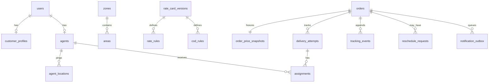

# System Design — Last-Mile Delivery Tracker

> Word count target: ≤ 800 words.

## Architecture

```
┌─────────────────────────────────────────────────┐
│  Next.js 14 (App Router, TypeScript)             │
│  Customer Portal │ Agent Portal │ Admin Portal   │
└────────────────────┬────────────────────────────┘
                     │ REST / JSON (JWT Bearer)
┌────────────────────▼────────────────────────────┐
│  FastAPI  (Python 3.11)                          │
│  /auth  /orders  /agent  /admin  /pricing  ...  │
│  ─────────────────────────────────────────────  │
│  Pricing Engine  │  Dispatch Engine              │
│  State Machine   │  Notification Outbox          │
└────────────────────┬────────────────────────────┘
                     │ SQLAlchemy ORM
┌────────────────────▼────────────────────────────┐
│  SQLite (dev) / PostgreSQL (prod)                │
└─────────────────────────────────────────────────┘
```

Three stateless API layers share one DB. Auth is JWT; roles are `CUSTOMER`, `DELIVERY_AGENT`, `ADMIN`. Public registration always creates `CUSTOMER` accounts.

---

## Data Model



---

## Zone Detection

Every `Area` row stores a postal code, coordinates, and a `zone_id`. When an order is created, pickup and drop postal codes are resolved to their areas. If both areas share the same zone, movement type is **INTRA_ZONE**; otherwise **INTER_ZONE**. Zone data is seeded—not hard-coded in logic.

---

## Volumetric / Billable-Weight Pricing

```
volumetric_weight = (L × B × H) / 5000        # cm³ → kg
billable_weight   = max(actual_weight, volumetric_weight)
```

All arithmetic uses Python `Decimal` to avoid float drift.

---

## B2B / B2C Rate Cards

A `RateCardVersion` is valid when `is_active=True AND effective_from ≤ now AND (effective_to IS NULL OR effective_to > now)`. When multiple valid cards exist, the latest `effective_from` wins (newest-version-takes-precedence).

Each card contains `RateRule` rows keyed by `(order_type, movement_type, min_weight, max_weight)`. The engine selects the single row whose weight band contains `billable_weight`:

```
charge = base_charge + (billable_weight × per_kg_charge)
```

---

## COD Surcharge

If `payment_type = COD`, a `CodRule` row for the matching `(rate_card_version_id, order_type)` is looked up and its flat `surcharge` is added to the total.

---

## Nearest-Agent Auto-Assignment

1. **Eligibility filter**: agents must be `AVAILABLE`, `active_delivery_count < max_concurrent_deliveries`, and have a GPS ping within the last 30 minutes.
2. **Haversine ranking**: for each eligible agent, compute great-circle distance from their last known location to the pickup coordinates. Add penalties: `workload_penalty = active_deliveries × 3.0` and `zone_penalty = 2.0` if the agent's current zone differs from the pickup zone.
3. **Selection**: lowest composite score wins. Result includes a human-readable explanation for each candidate (shown in Admin UI).
4. **Atomicity**: the winning agent's workload is incremented, an `Assignment` row is created, and the order transitions to `ASSIGNED`—all in one DB transaction.

---

## Availability / Capacity Modelling

Each `Agent` row carries `availability_status` (`AVAILABLE` / `UNAVAILABLE` / `INACTIVE`) and `active_delivery_count`. On assignment, the count increments; on delivery or failure, it decrements and `Assignment.unassigned_at` is timestamped. The active-assignment list filters `unassigned_at IS NULL`.

---

## Order State Machine

```
CREATED → CONFIRMED → ASSIGNED → PICKED_UP → IN_TRANSIT
                                                   ↓
                                         OUT_FOR_DELIVERY
                                          ↙           ↘
                                      DELIVERED      FAILED
                                                       ↓
                                              AWAITING_RESCHEDULE
                                                       ↓
                                                   CONFIRMED  (→ ASSIGNED …)
```

The state machine (`state_machine.py`) defines `ALLOWED_TRANSITIONS`. Every transition is validated before any write. `DELIVERED` is terminal.

---

## Immutable Tracking History

`TrackingEvent` rows are append-only. Each status change creates one event recording: `event_type`, `previous_status`, `new_status`, `actor_user_id`, `actor_role`, `delivery_attempt_id`, and a JSON metadata blob. Events are never updated or deleted, forming a tamper-evident audit log.

---

## Failed Delivery and Rescheduling

When a delivery fails:

1. `DeliveryAttempt.status → FAILED` (timestamped).
2. Order transitions to `FAILED` → tracking event recorded.
3. Order transitions to `AWAITING_RESCHEDULE` → second tracking event recorded.
4. `Assignment.unassigned_at` is set, closing the assignment.

When the customer reschedules:

1. A `RescheduleRequest` is created (auto-approved).
2. A new `DeliveryAttempt` (attempt N+1) is created in `PENDING`.
3. Order transitions `AWAITING_RESCHEDULE → CONFIRMED`.
4. Auto-assignment is attempted immediately. If no eligible agent is found, the order stays `CONFIRMED` and an audit event records the failure—the reschedule itself never fails.

---

## Notifications

Every status-change call writes a `NotificationOutbox` row (same transaction as the tracking event). After the transaction commits, FastAPI `BackgroundTasks` calls `process_pending_notifications`, which iterates pending rows and dispatches via the configured provider (console in dev; Email/SMS providers stubbed for credential injection in prod). The manual `POST /notifications/process` admin endpoint remains available for retry.
