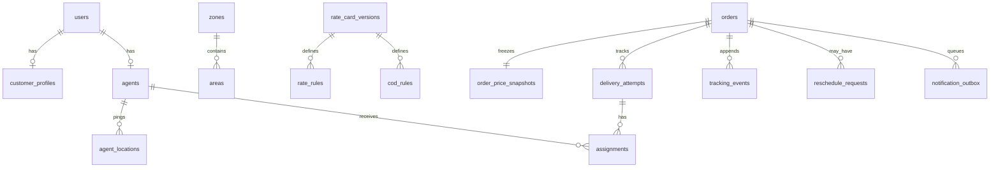

# System Design — Last-Mile Delivery Tracker

## Architecture

```
┌─────────────────────────────────────────────────┐
│  Next.js 14 (App Router, TypeScript)             │
│  Customer Portal │ Agent Portal │ Admin Portal   │
└────────────────────┬────────────────────────────┘
                     │ REST / JSON (JWT Bearer)
┌────────────────────▼────────────────────────────┐
│  FastAPI (Python 3.11)                           │
│  /auth  /orders  /agent  /admin  /pricing  ...   │
│  ─────────────────────────────────────────────   │
│  Pricing Engine  │  Dispatch Engine              │
│  State Machine   │  Notification Outbox          │
└────────────────────┬────────────────────────────┘
                     │ SQLAlchemy ORM
┌────────────────────▼────────────────────────────┐
│  SQLite (dev) / PostgreSQL (prod)                │
└─────────────────────────────────────────────────┘
```

Three stateless API layers share one database. Auth uses JWT Bearer tokens; roles are `CUSTOMER`, `DELIVERY_AGENT`, and `ADMIN`. Public registration automatically creates `CUSTOMER` accounts.

---

## Data Model



---

## Serviceability & Zone Resolution

Every `Area` row stores a 6-digit PIN code, coordinates, and a `zone_id`. When quoting or creating orders, pickup and drop PINs are resolved against the database:
- If either PIN is unmapped, `UNSERVICEABLE_AREA` error is raised.
- If both PINs share the same `zone_id`, movement type is **INTRA_ZONE**; otherwise **INTER_ZONE**.
- 50 PIN codes across 5 Bengaluru zones (South, Central, East, North, West) are pre-configured.

---

## Volumetric / Billable-Weight Pricing Engine

$$\text{volumetric\_weight} = \frac{L \times B \times H}{5000} \quad (\text{cm}^3 \rightarrow \text{kg})$$
$$\text{billable\_weight} = \max(\text{actual\_weight}, \text{volumetric\_weight})$$

All arithmetic uses Python `Decimal` to avoid floating-point inaccuracies.

---

## Rate Cards & COD Surcharges

A `RateCardVersion` is valid when `is_active=True AND effective_from ≤ now AND (effective_to IS NULL OR effective_to > now)`.
The pricing engine matches a `RateRule` for `(order_type, movement_type, min_weight ≤ billable ≤ max_weight)`:

$$\text{Total Charge} = \text{Base Charge} + (\text{Billable Weight} \times \text{Per-Kg Charge}) + \text{COD Surcharge}$$

---

## Nearest-Agent Auto-Assignment Engine

1. **Eligibility Filter**: Agents must be `AVAILABLE`, `active_delivery_count < max_concurrent_deliveries`, and have a GPS ping within the last 30 minutes.
2. **Haversine Distance & Penalty Scoring**:
   $$\text{Score} = \text{Distance}_{\text{pickup}}(\text{km}) + (\text{Active Deliveries} \times 3.0) + (\text{Zone Mismatch Penalty} \times 2.0)$$
3. **Selection & Transaction**: The agent with the lowest composite score wins. An `Assignment` row is created, active delivery count increments, and order status transitions to `ASSIGNED` in a single DB transaction.

---

## Order State Machine

```
CREATED → CONFIRMED → ASSIGNED → PICKED_UP → IN_TRANSIT
                                                   ↓
                                         OUT_FOR_DELIVERY
                                          ↙           ↘
                                      DELIVERED      FAILED
                                                       ↓
                                              AWAITING_RESCHEDULE
                                                       ↓
                                                   CONFIRMED  (→ ASSIGNED …)
```

Transitions are enforced by `state_machine.py`. `DELIVERED` and `CANCELLED` are terminal states.

---

## Immutable Tracking Audit Log

`TrackingEvent` records are append-only. Each status transition creates an immutable record storing `event_type`, `previous_status`, `new_status`, `actor_role`, `actor_user_id`, and a JSON metadata blob for auditing.

---

## Rescheduling & Cancellation

- **Cancellation**: Customers can cancel orders in `CREATED`, `CONFIRMED`, or `ASSIGNED` state. Cancelling an assigned order frees the agent's workload capacity.
- **Reschedule**: When a delivery fails (`FAILED`), it auto-queues for `AWAITING_RESCHEDULE`. The customer picks a new date (up to 30 days in advance). Order returns to `CONFIRMED` and triggers immediate auto-assignment.

---

## Notifications Outbox

Status changes write pending records to `NotificationOutbox`. FastAPI `BackgroundTasks` processes the outbox asynchronously, logging to console in development or dispatching via SMTP Email / Twilio SMS in production.
